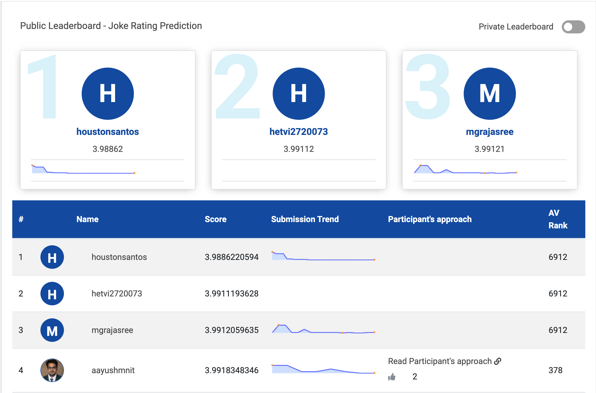

Nesta competição da Analytics Vidhya temos que prever notas que são atribuidas a piadas, vamos cria um modelo de recomendação (**RecSys**). Para validarmos o modelo vou utilizar a métrica **RMSE** estipulada pela competição.

    

Os exemplos são diversos: a Amazon recomenda livros (ou qual coisa do marketplace), a Netflix faz recomendação de Filmes, o Mendeley recomenda artigos ciêntíficos, a Globo.com recomenda notícias e o Spotify às músicas.

*   Temos algumas opções de algoritimos de Machine Learning para RecSys.

    *   Filtragem Baseada em Conteúdo (Content-Based)
    *   Filtragem Colaborativa (Collaborative Filter)
    *   Sistemas Híbridos (Hybrid)
    *   Cold-Start

### Approach

Utilizando à biblioteca [_**Surprise**_](https://surpriselib.com/), irei cria um modelos utilizando **SVD** _(Singular Value Decomposition)_, _Filtragem Colaborativa_.

O **SVD** realiza a fatoração de matrizes, isso pode ser um problema quando temos muitos dados, pois às matrizes seram muito esparsas, isso resultarar em custo computacional muito alto levando muito tempo de processamento. Mas vamos em frente....

$$
\begin{align} 
\hat r_i = \mu + b_u + b_i + q_i^T p_u
\end{align}
$$

### Resultado 

Trabalhando algumas técnicas como aleatoriedade, otimização e validação cruzada, lembrando que nossa métrica oficial da competição é a RMSE...

$$
\begin{align}
\text{RMSE} = \sqrt {\frac{1}{n} \sum_{i=1}^n (y_i - \hat y_i)^2} 
\end{align}
$$

* `Primeiro resultado` com o modelo default foi 4.2885941442.
* `Segundo resultado` explorando à aleatoriedade foi 4.2755483293.
* `Terceiro resultado` realizando a otimização do modelo foi 4.0125360492.
* `Quarto resultado` realizando à cross-validation no modelo otimizado foi 3.9817849012.

Nossa RMSE final foi 3.9817849012, este é resultado para nosso submission.

Agora vamos dar uma olhada como ficou nossa MAE...

* `MAE cross-validation` 3.0384427405

$$
\begin{align}
\text{MAE} = \frac{1}{n} \sum_{i=1}^n | y_i - \hat y_i | 
\end{align}
$$

Em validação com um dataset com 537880 registros nossa **RMSE vencedora foi de 3.9886220594** 🥇, deviando muito pouco de nossa **RMSE** final de treino e teste. Nosso erro foi de apenas **0.006837158199999749** ficou TOP.

    

Para chegar nesse resultado algumas tentativas foram realizadas com modelos, algoritmos e bibliotecas diferentes. 

